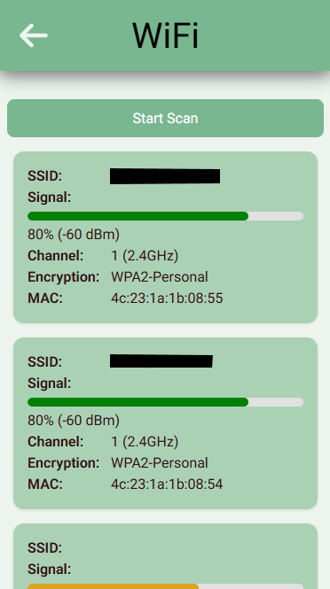
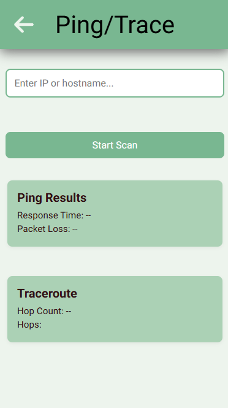
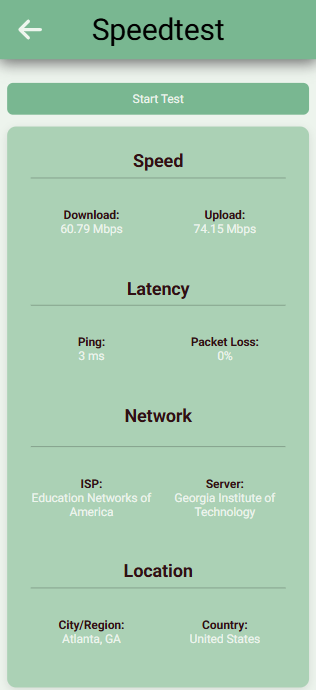
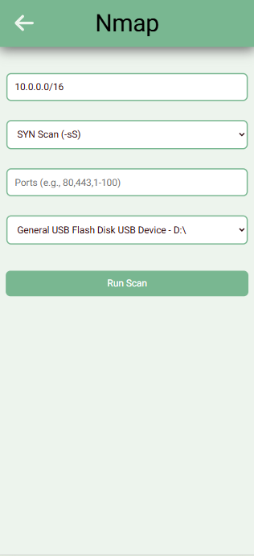
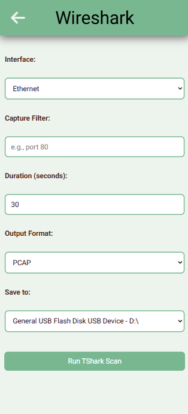

# NetScuffed

This project is a custom-built network diagnostics tool designed as a cost-effective alternative to other commercial networking devices. Originally built to run on a handheld Raspberry Pi (or similar) device, it also works seamlessly on Linux and Windows PCs.

## Table of Contents

- [Features](#features)
- [Installation](#installation)
- [Usage](#usage)
- [Contributing](#contributing)

## Features

### LLDP

This is the core feature I set out to replicate. I often found myself lugging around a laptop just to gather port information, and I wanted a lighter, more portable tool. This feature uses tshark to capture LLDP packets and parse the relevant information to the frontend, making it easy to identify switch ports and connected devices in the field.
<br><br><br>

<p align="center">
  
</p>

### Wireless Scan

While this feature is easily replicated by most smartphones using available apps, it's included here for the sake of completeness and to support users building a dedicated handheld device.
<br><br><br>

<p align="center">
  
</p>

### Ping/Trace

A straightforward implementation that uses Bash or PowerShell (depending on the platform) to run standard ping and traceroute/tracert commands. The output is parsed and displayed in the frontend for quick diagnostics. Simple, but essential.
<br><br><br>

<p align="center">
  
</p>

### Speedtest

This feature uses [Speedtest-Net](https://www.npmjs.com/package/speedtest-net) after experimenting with several alternatives. While it works reliably, a key limitation is that it always uses the system’s default network interface—there’s no built-in way to specify a particular interface. TYPICALLY Ethernet will take precedent over wifi but if you find yourself struggling to test the intended interface you can disconnect from the wifi network either natively on your device or in the settings menu of the app.
<br><br><br>

<p align="center">
  
</p>

### Nmap

This tool allows you to run simple nmap scans against a target, host, or IP range (including CIDR notation) and exports the resulting scan data to a removable drive in a .txt file.
<br><br><br>

<p align="center">
  
</p>

### Wireshark

Similar to the Nmap scan feature, this tool uses tshark to capture network traffic and exports the data to a removable drive in either .txt or .pcap format. A capture duration must be specified to control how long the traffic is recorded.
<br><br><br>

<p align="center">
  
</p>

<br>
<br>
<br>

Some features are simplified compared to their full professional counterparts, but the app delivers a powerful and flexible toolkit for fieldwork or lab diagnostics without the enterprise price tag. This feature works by using bash/powershell to obtain relavent wifi data.

## Installation

```bash
# Example installation steps
git clone https://github.com/yourusername/yourproject.git
cd yourproject
npm install
```

## Usage

```
npm start
```

## Contributing

Pull requests are welcome. For major changes, please open an issue first to discuss what you would like to change.
